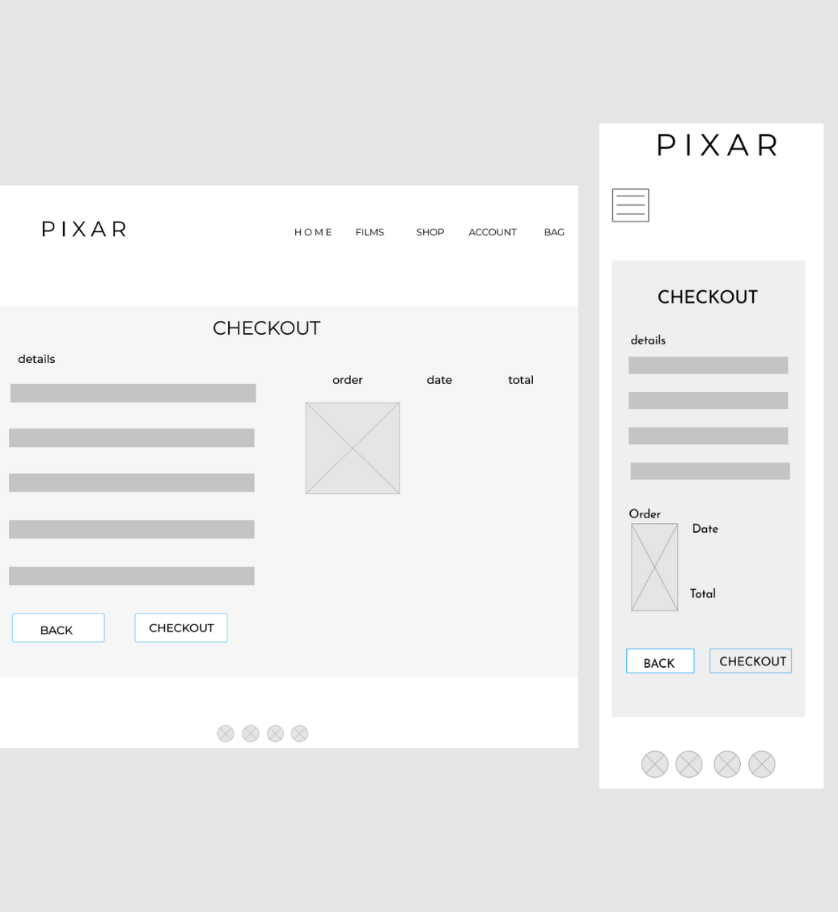

MAIN IMAGE

[Live Site](https://pixar-ecommerce.herokuapp.com/)

# About

This website is based off of the one and only, Disney Pixar site. Ive always been a fan of Pixar's website as its simple, sleek and minimal while still bringing in their touch of magic and nostalgia from their films. 

# Table of Contents

1. - [User Experience](#UX)
        - [The Strategy Plane](##The-Strategy-Plane)
        - [User Stories](###User-Stories)
    
    ii. [The Scope Plane](## The Scope Plane)
    iii. [The Structure Plane](## The Structure Plane)
    iv. [The Skeleton Plane](## The Skeleton Plane)
        - [Wireframes]()
    v. [The Surface Plane](## The Surface Plane)
        - [Mockups]()
        - [Color Scheme](### Color Scheme)
        - [Typography](### Typography)

2. [Features](# Features)
    - [Features Accross The Site](## Features Accross The Site)
    - [Features Specific To Pages](## Features Specific To Pages)

# UX
## The Strategy Plane

Pixar's film taget audience are very wide as its a universal studio that everyone loves, and therefore doesnt have a niche, specific audience. I wanted to project this through my site so that a large demograpic can easily access the webiste without any difficulty.

### Target Audeince for My Pixar Site :
    - Age: 15-44 as the films are loved by almost everyone including children, teenagers and adults.
    - Users who are big fans of Pixar films.
    - Users who need information on characters or film trailers.
    - Users who are able to use a device connected to the internet
    - Users who want to purchase Pixar toys, clothes and merchandise.
        
### Features:

As part of the planning process for the strategy plane, i find it helpful to plan out which features are of most importance to include in the project on a small scale of 1-3 (3 being the most important.) By doing this technique, i am able to focus more on the higher ranked features and work my way down the table.

FEATURES IMAGE

### User Stories

- #### Shopper Stories
    - I want to view all the products that are available to buy in order to purchase them.
    - I want to be able to view an individual item's details including: price, description, rating, image, available sizes and category
    - I want to be able to see the total of my bag at any time in order to avoid spending much and keep updated.
    - I want to easily be able to sort and filter the available products across all/specific categories, identifying the best rated, best priced and alphabetically sorted.
    - I want to easily acces a specific category of available products.
    - Search for a product by name or description to quickly see if its available.
    - I want to easily select available size and qauntity of product.
    - I want to View items in my bag before purchasing.
    - I want to Adjust or delete quantity of items in my bag.
    - I want to enter payement information easily without hassle and feel safe and secure doing so.
    - I want to view an order confirmation automatically after checkout is successful.
    - I want to recieve an order confirmation email after checking out to keep in records.

- #### Site User Stories
    - I want to be able to easily register for an account and view my profile when logged in.
    - I want ot be able to Easily login and logout
    - Recover my password easily to access my account incase i forget my password.
    - Recieve an email confirmation after registering
    - View my order history, order confirmations and save payement information in my profile.

- #### Store management Stories
    - Add new items to the store easily.
    - Edit and update existing products to change pricing, description images, and other criteria.
    - Delete items that are no longer for sale.

## The Scope Plane
- #### The minimal Product for my project is an e-commerce site with the following features:
    - A payement system
    - A profile page
    - A products page
    - Authorization
- Additional Features can be seen in the [Features]() section.

## The Structure Plane
The structure of my site is outlined below.

- #### Home app 
    #### HTML files
    - The home.html file is the landing page of the whole site. Includes main hero image with a 'discover' link to feature films page. As you scroll down, four links appear to all pages of the site for easy access.

- #### Discover app 
    #### HTML files
    - Includes all html files for each individual film on the feature films template. Each individual film template includes : 
    - Hero image of film.
    - Film logo
    - Film plot 
    - Film trailer
    - Images of characters and their roles within the film
    - The films.html template showcases all feature films that pixar has created. The template includes an Image with the title 'feature films' and all film posters which redirect to individual film templates.

- #### Products app 
    #### HTML files
    - The products.html template is where all available products can be viewed by site users and shoppers. The Products displayed on this page will differ depending on which Category, Brand or specified search query the user is searching by. If none have been selected, it will display all Products available on the site until filtered.
    - The products_detail.html template id shown when a product is clicked on within the products template. The details page shows the product image, description, price, sizes available and quantity. It also gives the user the option to add to bag or keep shopping.
    - The edit_product.html template allows only the admin to edit an existing product.
    - The add _product.html template contains a form for the admin to create and add a new product to the site.
    #### Cateogory Model - Stores Item categories
        name = models.CharField(max_length=254)
    #### Product Model - stores Individual Item information
        category = models.ForeignKey('Category', null=True, blank=True, on_delete=models.SET_NULL)
        sku = models.CharField(max_length=254, null=True, blank=True)
        name = models.CharField(max_length=254)
        description = models.TextField()
        has_sizes = models.BooleanField(default=False, null=True, blank=True)
        price = models.DecimalField(max_digits=6, decimal_places=2)
        rating = models.DecimalField(max_digits=6, decimal_places=2, null=True, blank=True)
        image_url = models.URLField(max_length=1024, null=True, blank=True)
        image = models.ImageField(null=True, blank=True)

- #### Profiles app 
    #### HTML files
    - The profile.html template displays the user's profile to the user. It contain their saved delivery details and order history. This can only be seen by someone who has registered for an account.
    #### Profile Model - securely stores information on each user. This can be used in checkout to prefill the checkout form.
        user = models.OneToOneField(User, on_delete=models.CASCADE)
    default_phone_number = models.CharField(max_length=20, null=True, blank=True)
    default_street_address1 = models.CharField(max_length=80, null=True, blank=True)
    default_street_address2 = models.CharField(max_length=80, null=True, blank=True)
    default_town_or_city = models.CharField(max_length=40, null=True, blank=True)
    default_county = models.CharField(max_length=80, null=True, blank=True)
    default_postcode = models.CharField(max_length=20, null=True, blank=True)
    default_country = CountryField(blank_label='Country', null=True, blank=True)

- #### Contact app 
    #### HTML files
    - The contact.html template contains a form for site users or shoppers to contact the site admin with any further questions.

- #### Checkout app 
    #### HTML files
    - The checkout.html template displays the final checkout page to the user. It shows them a summary of their order, and gives them a form to complete with their deleivery details. They also input their payement information and once the payement has gone through, they are redirected to the checkout success template.
    - The checkout_success.html template gives the shopper an order confirmation with a summary with all of the details of the order and the personal details the user put in on the page prior.
    #### Order Model - Holds information of each order, and is created when a user completes the checkout.
        order_number = models.CharField(max_length=32, null=False, editable=False)
        user_profile = models.ForeignKey(UserProfile, on_delete=models.SET_NULL,
                                     null=True, blank=True, related_name='orders')
        full_name = models.CharField(max_length=50, null=False, blank=False)
        email = models.EmailField(max_length=254, null=False, blank=False)
        phone_number = models.CharField(max_length=20, null=False, blank=False)
        country = CountryField(blank_label='Country *', null=False, blank=False)
        postcode = models.CharField(max_length=20, null=True, blank=True)
        town_or_city = models.CharField(max_length=40, null=False, blank=False)
        street_address1 = models.CharField(max_length=80, null=False, blank=False)
        street_address2 = models.CharField(max_length=80, null=True, blank=True)
        county = models.CharField(max_length=80, null=True, blank=True)
        date = models.DateTimeField(auto_now_add=True)
        delivery_cost = models.DecimalField(max_digits=6, decimal_places=2, null=False, default=0)
        order_total = models.DecimalField(max_digits=10, decimal_places=2, null=False, default=0)
        grand_total = models.DecimalField(max_digits=10, decimal_places=2, null=False, default=0)
        original_bag = models.TextField(null=False, blank=False, default='')
        stripe_pid = models.CharField(max_length=254, null=False, blank=False, default='')
    #### OrderLine Model - is used for calucations in the Order Model
        order = models.ForeignKey(Order, null=False, blank=False, on_delete=models.CASCADE, related_name='lineitems')
        product = models.ForeignKey(Product, null=False, blank=False, on_delete=models.CASCADE)
        product_size = models.CharField(max_length=2, null=True, blank=True) # XS, S, M, L, XL
        quantity = models.IntegerField(null=False, blank=False, default=0)
        lineitem_total = models.DecimalField(max_digits=6, decimal_places=2, null=False, blank=False, editable=False)

- #### Bag app 
    #### HTML files
    - The bag.html template allows users to view their bag contents, make changes to quantites and delete items from their bag. They also have the option to checkout when they have items in their bag.

## The Skeleton Plane
### Wireframes

  
Home

  

  
Films 

  

  
Films details 

  

  
Shop 

  

  
Login 

  

  
Register 

  

  
Profile 

  

  
Product Details 

  

  
Add product(Admin) 

  

  
Checkout 

  

  
Checkout Success

  

  
Bag

  

    
### Mockups
    

  
Home

  

  
Films

  

  
Film Details

  

  
Shop

  

  
Login

  

  
Register

  

  
Profile

  

  
Product Details

  

  
Add Product(Admin)

  

  
Checkout

  

  
Checkout Success

  

  
Bag

  

        
    
