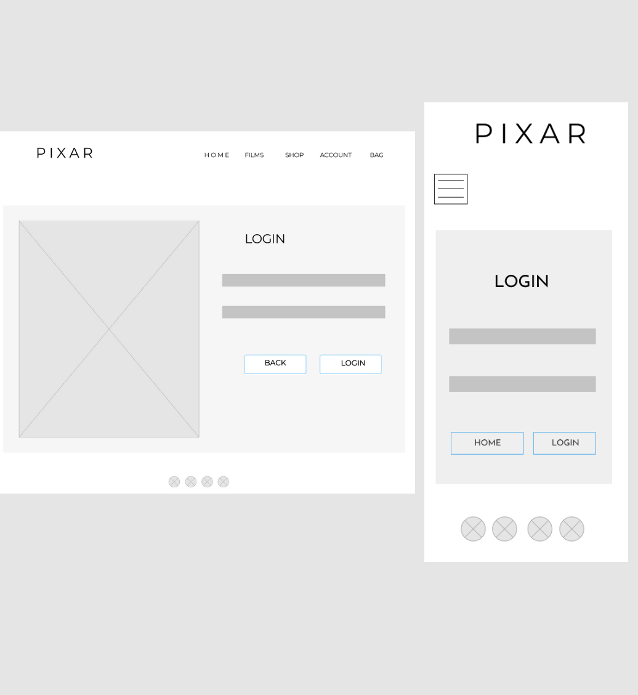

MAIN IMAGE

[Live Site](https://pixar-ecommerce.herokuapp.com/)

# About

This website is based off of the one and only, Disney Pixar site. Ive always been a fan of Pixar's website as its simple, sleek and minimal while still bringing in their touch of magic and nostalgia from their films. 

# Table of Contents

1. - [User Experience](#UX)
        - [The Strategy Plane](##The-Strategy-Plane)
        - [User Stories](###User-Stories)
    
    ii. [The Scope Plane](## The Scope Plane)
    iii. [The Structure Plane](## The Structure Plane)
    iv. [The Skeleton Plane](## The Skeleton Plane)
        - [Wireframes]()
    v. [The Surface Plane](## The Surface Plane)
        - [Mockups]()
        - [Color Scheme](### Color Scheme)
        - [Typography](### Typography)

2. [Features](# Features)
    - [Features Accross The Site](## Features Accross The Site)
    - [Features Specific To Pages](## Features Specific To Pages)

# The Strategy Plane

Pixar's film taget audience are very wide as its a universal studio that everyone loves, and therefore doesnt have a niche, specific audience. I wanted to project this through my site so that a large demograpic can easily access the webiste without any difficulty.

## Target Audeince for My Pixar Site :
    - Age: 15-44 as the films are loved by almost everyone including children, teenagers and adults.
    - Users who are big fans of Pixar films.
    - Users who need information on characters or film trailers.
    - Users who are able to use a device connected to the internet
    - Users who want to purchase Pixar toys, clothes and merchandise.
        
## Features:

As part of the planning process for the strategy plane, i find it helpful to plan out which features are of most importance to include in the project on a small scale of 1-3 (3 being the most important.) By doing this technique, i am able to focus more on the higher ranked features and work my way down the table.

FEATURES IMAGE

## User Stories

- ### Shopper Stories
    - I want to view all the products that are available to buy in order to purchase them.
    - I want to be able to view an individual item's details including: price, description, rating, image, available sizes and category
    - I want to be able to see the total of my bag at any time in order to avoid spending much and keep updated.
    - I want to easily be able to sort and filter the available products across all/specific categories, identifying the best rated, best priced and alphabetically sorted.
    - I want to easily acces a specific category of available products.
    - Search for a product by name or description to quickly see if its available.
    - I want to easily select available size and qauntity of product.
    - I want to View items in my bag before purchasing.
    - I want to Adjust or delete quantity of items in my bag.
    - I want to enter payement information easily without hassle and feel safe and secure doing so.
    - I want to view an order confirmation automatically after checkout is successful.
    - I want to recieve an order confirmation email after checking out to keep in records.

- ### Site User Stories
    - I want to be able to easily register for an account and view my profile when logged in.
    - I want ot be able to Easily login and logout
    - Recover my password easily to access my account incase i forget my password.
    - Recieve an email confirmation after registering
    - View my order history, order confirmations and save payement information in my profile.

- ### Store management Stories
    - Add new items to the store easily.
    - Edit and update existing products to change pricing, description images, and other criteria.
    - Delete items that are no longer for sale.

## The Scope Plane
- ### The minimal Product for my project is an e-commerce site with the following features:
    - A payement system
    - A profile page
    - A products page
    - Authorization
- Additional Features can be seen in the [Features]() section.

## The Structure Plane
The structure of my site is outlined below.

- ### Home app 
    #### HTML files
    - The home.html file is the landing page of the whole site. Includes main hero image with a 'discover' link to feature films page. As you scroll down, four links appear to all pages of the site for easy access.

- ### Discover app 
    #### HTML files
    - Includes all html files for each individual film on the feature films template. Each individual film template includes : 
    - Hero image of film.
    - Film logo
    - Film plot 
    - Film trailer
    - Images of characters and their roles within the film
    - The films.html template showcases all feature films that pixar has created. The template includes an Image with the title 'feature films' and all film posters which redirect to individual film templates.

- ### Products app 
    #### HTML files
    - The products.html template is where all available products can be viewed by site users and shoppers. The Products displayed on this page will differ depending on which Category, Brand or specified search query the user is searching by. If none have been selected, it will display all Products available on the site until filtered.
    - The products_detail.html template id shown when a product is clicked on within the products template. The details page shows the product image, description, price, sizes available and quantity. It also gives the user the option to add to bag or keep shopping.
    - The edit_product.html template allows only the admin to edit an existing product.
    - The add _product.html template contains a form for the admin to create and add a new product to the site.
    ### Cateogory Model - Stores Item categories
        name = models.CharField(max_length=254)
    ### Product Model - stores Individual Item information
        category = models.ForeignKey('Category', null=True, blank=True, on_delete=models.SET_NULL)
        sku = models.CharField(max_length=254, null=True, blank=True)
        name = models.CharField(max_length=254)
        description = models.TextField()
        has_sizes = models.BooleanField(default=False, null=True, blank=True)
        price = models.DecimalField(max_digits=6, decimal_places=2)
        rating = models.DecimalField(max_digits=6, decimal_places=2, null=True, blank=True)
        image_url = models.URLField(max_length=1024, null=True, blank=True)
        image = models.ImageField(null=True, blank=True)

- ### Profiles app 
    #### HTML files
    - The profile.html template displays the user's profile to the user. It contain their saved delivery details and order history. This can only be seen by someone who has registered for an account.
    #### Profile Model - securely stores information on each user. This can be used in checkout to prefill the checkout form.
        user = models.OneToOneField(User, on_delete=models.CASCADE)
    default_phone_number = models.CharField(max_length=20, null=True, blank=True)
    default_street_address1 = models.CharField(max_length=80, null=True, blank=True)
    default_street_address2 = models.CharField(max_length=80, null=True, blank=True)
    default_town_or_city = models.CharField(max_length=40, null=True, blank=True)
    default_county = models.CharField(max_length=80, null=True, blank=True)
    default_postcode = models.CharField(max_length=20, null=True, blank=True)
    default_country = CountryField(blank_label='Country', null=True, blank=True)

- ### Contact app 
    #### HTML files
    - The contact.html template contains a form for site users or shoppers to contact the site admin with any further questions.

- ### Checkout app 
    #### HTML files
    - The checkout.html template displays the final checkout page to the user. It shows them a summary of their order, and gives them a form to complete with their deleivery details. They also input their payement information and once the payement has gone through, they are redirected to the checkout success template.
    - The checkout_success.html template gives the shopper an order confirmation with a summary with all of the details of the order and the personal details the user put in on the page prior.
    #### Order Model - Holds information of each order, and is created when a user completes the checkout.
        order_number = models.CharField(max_length=32, null=False, editable=False)
        user_profile = models.ForeignKey(UserProfile, on_delete=models.SET_NULL,
                                     null=True, blank=True, related_name='orders')
        full_name = models.CharField(max_length=50, null=False, blank=False)
        email = models.EmailField(max_length=254, null=False, blank=False)
        phone_number = models.CharField(max_length=20, null=False, blank=False)
        country = CountryField(blank_label='Country *', null=False, blank=False)
        postcode = models.CharField(max_length=20, null=True, blank=True)
        town_or_city = models.CharField(max_length=40, null=False, blank=False)
        street_address1 = models.CharField(max_length=80, null=False, blank=False)
        street_address2 = models.CharField(max_length=80, null=True, blank=True)
        county = models.CharField(max_length=80, null=True, blank=True)
        date = models.DateTimeField(auto_now_add=True)
        delivery_cost = models.DecimalField(max_digits=6, decimal_places=2, null=False, default=0)
        order_total = models.DecimalField(max_digits=10, decimal_places=2, null=False, default=0)
        grand_total = models.DecimalField(max_digits=10, decimal_places=2, null=False, default=0)
        original_bag = models.TextField(null=False, blank=False, default='')
        stripe_pid = models.CharField(max_length=254, null=False, blank=False, default='')
    #### OrderLine Model - is used for calucations in the Order Model
        order = models.ForeignKey(Order, null=False, blank=False, on_delete=models.CASCADE, related_name='lineitems')
        product = models.ForeignKey(Product, null=False, blank=False, on_delete=models.CASCADE)
        product_size = models.CharField(max_length=2, null=True, blank=True) # XS, S, M, L, XL
        quantity = models.IntegerField(null=False, blank=False, default=0)
        lineitem_total = models.DecimalField(max_digits=6, decimal_places=2, null=False, blank=False, editable=False)

- ### Bag app 
    #### HTML files
    - The bag.html template allows users to view their bag contents, make changes to quantites and delete items from their bag. They also have the option to checkout when they have items in their bag.

# The Skeleton Plane
## Wireframes

  
Home

  

  
Films 

  

  
Films details 

  

  
Shop 

  

  
Login 

  

  
Register 

  

  
Profile 

  

  
Product Details 

  

  
Add product(Admin) 

  

  
Checkout 

  

  
Checkout Success

  

  
Bag

  

    
## Mockups
    

  
Home

  

  
Films

  

  
Film Details

  

  
Shop

  

  
Login

  

  
Register

  

  
Profile

  

  
Product Details

  

  
Add Product(Admin)

  

  
Checkout

  

  
Checkout Success

  

  
Bag

  

# Surface Plane
- ## Color Scheme
  - The color scheme chosen for this project is simple, branching from one primary color: Blue. As the site mainly consists of vibrant images, i thought sticking to various shades of blue would go veyr nicely.
    
    COLOR SCHEME IMAGE

- ## Typography
  - This site uses a variation of two different fonts: Josephin sans & sans-serif.  I chose these two fonts as i took time to compare the fints used on the Pixar site and find something a little similar. I found that when adding letter spacing to these two fonts, it enahnced the simplicity of the site while still appearing similar to the Pixar site.

  TYPO IMAGE

- ## Imagery
  - Imagery is a huge part of the site and is critical to the users as Pixar fans are most appreciative of the clean and shiny graphics. Its used for both informative and entertainmenet purposes as images are displayed in item cards on the products template to allow users to visually engage with items and decide if they are interested to purchase. Images are also shown for aesthetic to bring in the magical and nostalgic feel that Pixar films have.Background images are used a lot throughout the site, the main one being Disney's famous blue sky thats used for their logo and intro to their films. I felt that by encourporating this in images, (as Pixar is one of Disney's brances) and making the colours a part of my site, it enhances the magical, nostalgic theme that my site gives off. I have made sure encorporated atleast one image on every page to keep the feel ongoing throught the site. Product images have been taken from the Disney Site and others have been created and edited through Canva.

  IMAGERY IMAGE

# Features
## Common Features Across All Pages

  - ### Header
    - The header is positioned to be fixed at the top of the screen and to always be visible to the user, no matter what screen size or device is being used. This allows an easy and seamless navigation across all pages, meaning that users can find it quickly.
    - The pixar logo is positioned at the top of the page within the header and when clicked on, redirect you to the home page. The logo is visible in the header when viewed on all screen sizes.
    - The navigation is inside of the header, seen on the right of the header. The pages consist of: Home, films, shop, account and bag. Both shop and account are dropdown menus, revealing more links. The 'shop' link, reveals 'Toys, Adult, Clothing, All Products' and the 'Account' link reveals 'Login, Register' for site visitors, 'Profile' for account holders, and 'Product Management' for the admin profiles. On smaller screens, the navigation collapses into a hamburger menu. This allows the site navigation to be easy and simple to use on all devices.
    - The bag icon is always visible on larger screens, however collapsed into a hamburger menu when on smaller screens. On the Hamburer menu, the bag is centered, standing out from the other links, and easily accessed as the header is fixed.
  - ### Buttons
    - There are two types of buttons throughout the site, both in the same style, just contrasting colours. E.g: one has white text and a blue backgound whereas the other has blue text, blue border and white text. These buttons mostly appear next to eachother when the user is given two options, e.g: 'keep shopping' and 'add to bag'.
  - ### Headings
    - Headings throughout the site appear the same in order for the structure to be easily recognised by the user. The font is always 'Josefin sans' and the letter spacing is constant throughout so that the heading can visibly appear different to the rest of the page and not just be different in size.
  - ### Footer
    - The footer is displayed at the bottom of the page and appears simplistic, corresponding the the colour scheme. It includes a hover effect for every individual social link, when hovered over, an icon appears over the social link and the color changed to the social medias logo colour. Eg: for the Facebook icon, it will turn blue, with an icon above saying 'Facebook'.
  - ### Toasts 
    - The toasts appear to let the user know that they have carried out an action, and whether it was successful. Eg: putting an item in your bag, a message appears showing the user their total of the bag, how much more they need before they get free delivery, and a checkout button. It appears as a pop up message underneath the navigation bar on the right on all devices and can be dismissed by clicking on the 'x' button.

## Features Specific To Pages
  - ### Home Page
    - A large hero image of a well known scene in a Pixar movie. 
    - The heading is a large motivational quote from the movie.
    - Th quote is followed by a 'discover' button that takes the user to the films page to explore their range of feature films.
    - Below the hero image are four cards that are essentially a quick navigation. The cards each have an image on them and a heading to where they redirect to. When each card is hovered over, they scale down and become smaller while covering the card in a house colour background. One of the cards redirects the user to a contact page which isnt shown on the navigation bar. I thought this would be best as i didnt want the nav bar to be overwhelmingly crowded and keep the simplicity flowing through the site. 

  - ### Films Page
    - A large hero image from a Pixar movie with the title of 'FEATURE FILMS'.This lets the user know that these are the main films that Pixar have created.
    - All feature films are diplayed in rows of 3, showing film posters against a white background. The white background works well as each poster includes various vibrant colours and so the white background allows them to stand out more.
    - The films are shown in order, from latest to oldest.
    - On the bottom right of the page, a back to top button is shown with a blue arrow to assist the user to scroll up quicker when they have reached near the bottom. This back to top button is visible and available to be clicked on at all times.

  - ### Film details Page
    - A large hero image from the chosen film and the film's logo is below.
    - A short summary of the film's plot to perhaps remind the user what the film is about.
    - The films trailer can be played on the page without the user leaving to go to Youtube. The trailer can be played and paused at anytime and can also be viewed in full screen. This is responsive on all devices.
    - A heading of the charcters names, followed by their images and a short summary. This is done for each character.
    - A back to top button for the user to navigate around easily.

  - ### Shop Page
    - A large hero image with the title of 'SHOP' followed by a smaller sub-heading.
    - A search bar enabling shoppers to search for a specific item quickly.
    - Items displayed in a responsive grid layout to be responsive on all screen sizes.
    - The image of items are above important information such as the items title, price, category and rating.
    - Item image can be clicked to bring the user to the details page.
    - Filter button is available and can be toggled to collapse or reveal sorting options.
  
  - ### Products Detail Page
    - Shows both product and descriptiom info on a responsive grid layout to accommodate all screen sizes.
    - Product image is large, and when clicked on, the image opens up in a seperate tab.
    - Product title, price, category, rating and description is available.
    - Shoppers are able to chose the quantity they want to put in their bag for that product.
    - A 'keep shopping' button is available for users to navigate back to the shop page quickly. 
    - A 'add to bag' button allows users to add products to their bag efficiently.

  - ### Login & Register page
    - Both these pages have the same layout in order to have a clear design structure.
    - login and register form are displayed on a card with an image alongside the form. 
    - Register form enables users to register with an email which they must confirm after, and a password that fits within the requirements.
    - Register page has two buttons at the bottom: 'back to login' which takes them to the login page incase they already have an account, and a sign up button which then asks them to verify their email.
    - The login page has two buttons at the bottom: 'home' which offers the user easy navigation for them to be redirected to the home page and 'sign in' which takes the user to the home page and giving them a message notification to let them know that they are signed in.

  - ### Bag page
    - When the bag is empty, an image apears with a Pixar character crying and some text saying that their bag is empty. Below this, there is a 'shop' button enabling the user to be redirected to the products page to fill up their bag.
    - When the bag has products inside, the product info appears alongside the quantity chosen, subtotal and delivery cost. 
    - Two buttons are placed under the quantity button : 'update' and 'remove'. These allow the user to edit any items in their basket; they can increase or decrease the amount they already have, and they can delete items.
    - There are two buttons at the bottom of the page: 'Keep shopping' and 'secure checkout' which offer easy navigation for the user to the products page or to the checkout page.

  - ### Delivery/Checkout Page
    - The shoppers order summary is diplayed on the right and the users details will be displayed on the left as a form layout. This allows the user to edit and add their details to the delivery. On smaller screen sizes, the order summary is shown first and below is the details form.
    - Delivery Details are provided as a form using crispy forms.
    - Users are given the option to save their delivery details to their profile if they have one,  otherwise, they are offered sign in and sign up buttons.
    - Users are provided with a secure checkout using stripe to enter their bank details.

  - ### Checkout Success Page
    - A thank you image is displayed at the top of the page.
    - The user is presented with their order information alongisde a confirmation email being sent to them.
    - A button at the bottom of the information: 'keep shopping'.

  - ### Profile Page
    - A form is diplayed with the users default delivery information and can be edited and updated for checkout. 
    - The shoppers order history is diplayed on the right, showing their order number, date, items and order total.
    - The users are able to click on a past order's confirmation number and it will take them to the checkout success page. However, they are displayed a message at the top of the screen alerting them that it is a past order.

  - ### Product management page (admin)
    - The *'add a product'* page allows the admin to fill out a form to add a product to appear in the products page and for shoppers to be able to purchase it. Th admin can create a description, rating, price title, category, sizes, image url or upload an image from their local device.
    - The *'edit a product'* page allows the admin to edit a product in any aspect. The category, sku, name, description, sizes, price,rating and image can all be edited and changed from the shop page.
    - Products can be deleted by the admin from the products page. Besides every product, is two button links: 'edit' and 'delete'

  - ### Contact
    - A form displayed on the page where the users can fill in the information asked and send their message to the site Admin

  ### Future Features to Add
    - Add different type of delivery options to chose from other than a default delivery.
    - Add an apple pay option to payements
    - Admin can recieve messages sent from site users from contact page into desired email.

# Testing
## Functionality

  - ### Navigation bar
    - The navigation bar is fixed at the top of any device and stays visible when the site is being scrolled.
    - All navigation links take the user to the relevant pages.
    - The shop link is a dropdown menu, when clicked on, it reveals a menu with item categories that bring the user to the products page with the selected category displayed   and items filtered.
    - The logo is a clickable link,  taking the user to the home page when clicked on.
    - The My Account link is a dropdown, revealing 'login' and 'register' for new users , allowing existeing users to access their account, and new members to join. When a user is successfully logged in, the dropdown menu reveals 'logout' 'profile'. 
    - The cart icon takes the user to the bag page to view what items are already inside, or if its empty. Below the cart, they are able to see how much the total items are that the user has chosen. When items are in the bag, the icon turns blue, standing out from the other links.
    - When each link in the user dropdown is clicked, the user is navigated to the appropriate page.
    - The nav bar is fully responsive. On smaller device viewports, the navbar collapses and a hamburger menu button is displayed instead.
    - When the hamburger button is clicked, the main menu items are revlealed and all work fine. The bag icon is placed at the bottom of the menu in the middle to stand out.
    - When the menu is opened, scrolling is still enabled on the page, however the menu stays fixed and on top of all content. 
    - When the hamburger menu is clicked again, the navigation bar closes.

  - ### The Footer
    - Footer is accessible and visible on all pages except from the checkout page when the user clicks on the chekcout button to purchase any items. This is done so that nothing can interfer with any purchases that the users are making and to avoid any errors.
    - When social links are clicked in the footer, they are redirected to the relevent page.
    - When hovered over, the icons have a filled in background and the name of the social media appears above in order to help the user identify which link will be clicked on.
    - Footer always stays at the bottom of the page, below any content.

  - ### Registration
    - The user is able to register and become a member by clicking on the register button from the main nav bar dropdown as they are directed to the register form page.
    - Users can click on the sign up buttons in various alluth pages such as the Login page.
    - Within the sign up form, all fields are required to be filled out, otheriwse the allauth displays a validation message. 
    - Allauth will send validation errors if: valid emails are not given, passwords are too short, do not match or are too common/easy, emails do not match.
    - When 'Sign Up' is clicked with a valid form, the user is redirected to a page with a message displayed to let the user know that an email has been sent and they have to validate their e-mail address. This page includes a button to redirect the user to the contact page if they have not recieved an email.
    - User receives an e-mail from Pixar with a link that brings the user to the 'Confirm E-mail Address'. When 'confirm" is clicked on this page, the user is re-directed to the 'Sign In' page alongside a pop up message saying 'email verified'
    - When a new user registers successfully, their profile is created automatically.

  - ### Log Out / Log in
    - A validation error will appear if username/e-mail and/or password were incorrect. It doesnt specify which field is incorrect so that malicious users don't know specifically which field was incorrect.
    - Users can log in using their existing Pixar Account.
    - The login validation form will display a validation message if either password or username/e-mail are left empty.
    - If the user clicks on 'Forgot Password', they are navigated to a page where they are asked to enter their e-mail address. They will then receive an e-mail with a link to reset the password and also remind them what their username is. When the link is clicked, the user is asked to enter the new password twice. If this is successful, the user is navigated to a success page with a button to redirect the user back to the login.
    - When the user is reseting their password, a validation error will appear if the passwords do not match.
    - The sign up link on the login page function as expected.
    - When the user clicks on 'logout', they are redirected to a page asking them if they would like to logout or not. If yes, the users session is removed, they are logged out and redirected to the home page as a non-authenticated user.
    - When a user logs in,they redirected to the home page and shown a message that they are logged in.

- ### Home page
  - Home page is responsive on all devices.
  - All links are working a take the user to the relevant pages. 
  - The discover button takes the user to the films page to discover Pixar's feature films.
  - Navigation cards at the bottom of the page all have a smooth animation and work as expected.

- ### Shop Page
  - When the shop link dropdown is clicked on, it reveals a menu with item categories that bring the user to the products page with the selected category displayed and items filtered.
  - The search bar is visible on the Shop page to allow users to search for the items that they are looking for.
  - The search bar is fully responsive and is scaled to fit on any device.
  - When the input is focused on, the border of the seach bar has a blue box-shadow in order to show the user they can now type inside of it. 
  - When an empty form is submitted, a pop up message appears underneath the navigation bar letting the user know that they didnt enter a search criteria
  - If a search criteria is entered and no results are found, the user is told so by a message below the search bar.
  - When the user enteres in a search criteria and presses search, the page refreshes and auto scrolls down to the section of found products.
  - There is a sort button below the search bar which reveals sorting buttons that sort selected items by added date, price, or alphabetical order. If the filter button is clicked again, the sorting buttons disappear.
  - All products within the page are laid out in a grid design, making it responsive on any device.Items appear in rows of 4 on large screens, 3 n medium, 2 on small, and 1 item per row is shown on normal mobile view.
  - Each product has a visible image, rating ,title, price and category.
  - When an Item's image is clicked, the user is redirected to the item's page where they can add to their bag.

- ### Product Details Page
  - The product detail page displays the product image on the left side and the product title, pice, category, rating and description on the other side. 
  - The Page also includes the avaiblable sizes for the user to chose from and a quantity toggle button that increases and decreases when the user clicks -/+. 
  - The user can only choose a max of 10 in quantity of an item otherwiase they will get an error.
  - The layout is repsonsive on all devices and the image and details move all to one column when viewed on mobile view.
  - Below the page, there is an 'add to bag' button that allows the user to add the item to their bag. A ag notification then appears, letting the user know that the item has been added.
  - The 'keep shopping' button redirect the user back to the products page.
  - When main image of product is clicked on, a seperate tab is opened with the individual image alone.

- ### Film Page
  - Films are shown in a layout grid of 3 posters per row. This is responsive across all devices as images decrese in size when viewed on smaller devices.
  - The back to top button is always displayed at the bottom right of the page, and when clicked on, takes the user to the top of the page making navigation easier and smoother.
  - When film posters are clicked on, the user is redirected to the relevant film details page.

- ### Film Details Pages
  - The film details pages include a relevant summary of each individual film.
  - A trailer video of the specific film. When the user clicks on the play button, The films trailer can be played on the page without the user leaving to go to Youtube. The trailer can be played and paused at anytime and can also be viewed in full screen. This is responsive on all devices.
  - The trailer can also be watched on youtube if the user clicks on the youtube logo on the video as a new tab opens up with the relevant video.
  - Each film details page includes images of all relevant charcters and a summary of them.
  - The back to top button is always displayed at the bottom right of the page, and when clicked on, takes the user to the top of the page making navigation easier and smoother.

- ### Bag page & toasts
  - When a user adds an itm to their bag, it is added to the bag and a notification appears letting the user know it is in their bag. The bag icon total also updates on the navigation bar.
  - Within the notification toast, the user is able to see the item/items image,price, quantity, and total thatthey have added.
  - When the user updates the items quantity or deletes an item from the bag, a toast appears showing the current bag total and a message letting the user know that they have done so successfully.
  - From bag toast, if the user clicks on 'Secure checkout', they are navigated to the Shopping bag page.
  - From the bag toast, when 'Secure Checkout' is clicked, the user is navigated to the checkout page.
  - If the last item was removed from the bag, page refreshes, the bag is diplayed as empty  and the toast appears, telling the user that they have removed the item.
  - If a bag is empty, an image appears alongisde a 'hey you!' title telling the user that their bag is empty. There is a button below syaing 'Shop' which will redirect the user to the shop page where they can add items to their bag.
  - Users can be redirected to the bag page from the navbar, bag toast, or checkout page.
  - If the user has items in their bag, they are able to view a summary of their items alongisde the image, title,size chosen, SKU, quantity subtotal, delivery fee and a message informing the user how much more they need to spend to get free delivery.
  - When the 'remove' button is clicked, the item is removed from the bag.
  - When the quantity toggle +/- button is clicked on, the quantity changes and when the user clicks on the 'update' button, the quantity is updated. This refreshes the page and aslo updates the subtotal and if there is any, the delivery fee.

- ### Checkout & checkout success Page
  - The checkout page displays the order summary, Delivery, Shipping, and Payment Info form.
  - Within the details form, all fields are required to be filled in except from the 'street address 2' 'county' and 'post code'. 
  - When required fields are not filled out,validation will prompt the user to fill it in.
  - If the user enters invalid card details, Stripe will return an error message for the user to try again.
  - When the form has been filled out correctly, and the user clicks on 'complete order', they are displayed with a loading spinner where they are not able to click on anything within the page until the payement has succeeded. The user is then are re-directed to the Checkout Success page where they can see their order details and confirmation email has been sent.
  - If the user is not logged in, they can log in or sign up using the links under the Delivery Form in order to save their delivery information.
  - If the user is logged in already, they are given an option to save their shipping details to their profile with a checkbox.

- ### Profile Page
  - The profile page is only accessible to authenticated users who have made accounts. It can be accessed through the 'my account' dropdwon menu in the navigation bar.
  - Users can fill out the form to save their delivery information to become default when checking out.
  - The user is able to edit the default information in the form and save them in the database byt clicking 'update information'.
  - Users are able to view their order history from their profile account underneath the title 'order history'.
  - Within the order history, users are able to view their order number, the date and time of the purchase, the items and their quantity, and the order total.
  - Orders in the order history are shown in order from oldest to latest.
  - The users are able to click on a past order's confirmation number and it will take them to the checkout success page. However, they are displayed a message at the top of the screen alerting them that it is a past order.

- ### Contact Page
  - The contact page can be found on the botton of the home page and when the user clicks on the image with the text 'contact', they are redirected to the contact page.
  - The user can fill in their full name, email address, and message within a form.
  - There are are two buttons at the bottom of the page: 'cancel' and 'send'.
  - The user can only click send once all fields are filled in within the form.
  - Once the send button is clicked alongside a vlide form, the user sees a pop up message confirming that their message has been sent and they are then redirected back to the home page.
  - If the uses clicks on the 'cancel' button, they are redirected to the home page and no further action is taken.

# Validators
## HTML5

  
Home - Pass

  

  
Films - Pass

  

  
Film Details - Pass

  

  
Shop - Pass

  

  
Product Details - Pass (1 warning advising for me to remove type attribute from script tag.)

  

  
Log In - Pass

  

  
Register - Pass

  

  
Bag - Pass

  

  
Checkout Success- Pass

  

  
Checkout- Pass (2 warnings advising for me to remove type attribute from script tag.)

  

  
Contact- Pass 

  

